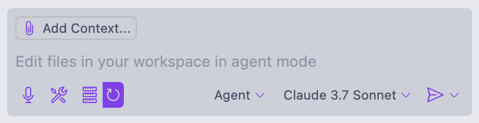

# AI Code Assistants

This repo was used during the AI Code Assistants workshop at the [Engineering Meetup on May 30th, 2025](https://www.notion.so/txi/Coding-Assistants-1ee0ea82ab9b80d296d3d978049b8190?source=copy_link) (note: this is an internal link). The purpose is to walk us through the use of Copilot in VS Code.

## FAQS

**Can I use Cursor/ Claude Code / another tool instead?**

Other coding assistants such as Cursor or Claude Code can be used in a similar way to Copilot, but you may need to figure your way around some differences as you follow along.

**I don't use VS Code or related IDE, can I use \<insert editor\> instead?**

Theoretically yes, although depending on what you're using instead you might not have access to all of the features we'll be discussing. Feel free to follow along using your editor and code assistant of choice though.

**I don't have a Copilot license, how do I get one?**

Ask in the #eng-core channel in Slack if you need a license and don't have one yet.

## Prerequisites

- [VS Code](https://code.visualstudio.com/docs/setup/setup-overview) (or other editor of choice set up and ready to go)
- [Copilot](https://code.visualstudio.com/docs/copilot/setup) (or other code assistant of your choice set up and ready to go)

## Actvities

### Introduction

- [1. Introduction to copilot in VS Code](#1-introduction-to-copilot-in-vs-code)
- [2. Caveats](#2-caveats)

### Exploring A Workflow

- [3. Start with research](#3-start-with-research)
- [4. Save design decisions](#4-save-design-decisions)
- [5. Save and continue conversations](#5-save-and-continue-conversations)
- [6. Working through a plan in small steps](#6-working-through-a-plan-in-small-steps)
- [7. Working with persistent prompts (i.e. TODO.md)](#7-working-with-persistent-prompts-ie-todomd)
- [8. Capture repeated workflows in instructions](#8-capture-repeated-workflows-in-instructions)

## Introduction

### 1. Using copilot in VS Code

1. We can open Copilot by opening our secondary side bar on the right hand side of the VS Code editor window. Either click the  button or use the keyboard shortcut (`cmd + opt + b` on Mac).
2. The chat input window is at the bottom of the panel.

    

3. At the bottom right of the chat input we have the option to select the mode and the model we want to use.
  a. If we want Copilot to just answer a question and not to write or change code, we use ***Ask mode***.
  b. If we want Copilot to write or change code, we use ***Agent mode***. This provides Copilot with the ability to inspect our codebase too, and we can specifically drawn its attention to certain pieces of context too, which we'll get to in a bit.
  c. We'll use `Claude 3.7 Sonnet` for this workshop as Claude models are usually better at coding that GPT models. Feel free to experiment though. We could also use `Claude Sonnet 4`, which may well give us better results, but we should avoid the "thinking" version outside of research or generating plans as it's slower (and in fact we can't select it when in Agent mode anyway).
4. At the top left of the window is the selector that lets us specifically add context to our prompts. Agent mode will read through our codebase for the information it needs anyway, so we don't always have to explicitly add all pertinent files. We'll cover this in more detail as we go. The current file that is opened and focused in our editor is always auto-selected.

### 2. Caveats

Before we get stuck in, here are some things to keep in mind when working with AI code assistants:

1. AI is ***non-deterministic*** - We’re not all going to get the same results. You won't see the exact same results twice.
2. Take ***small steps*** - AI can (and will) write whole novels if you let it. Don’t.
3. If the solution is bad, ***try again*** - Roll the dice and hit that refresh button!
4. If the solution is very/still bad, ***adjust your prompt*** - Sometimes you’ll realize that the AI needs more/better prompting. Either do so inline so that it has context for what went wrong, or summarize first and then start a new convo from that summary and a new improved prompt.
5. Beware of ***context bloat*** - The longer the conversation, the slower and worse the results. LLMs can only have full attention within a given context window. Outside of that they will start to lose context and/or misrepresent prior context within that conversation. Keep your conversations short. Summarizing is an important tool in this regard.
6. Beware of ***error loops or doom cycles*** - Sometimes the code assistant will get stuck, either trying to figure out what it needs to do to complete a task, or flip flopping from one error state to another. Sometimes the best course of action is to stop the conversation, summarize it and then figure out a better approach (better prompt, smaller steps, etc).
7. Beware of the ***commands Copilot wants to run*** - I’ve never experienced Copilot running commands without asking my permission first. However, I *have* seen it ask to run commands that were either wrong or downright harmful. Always read a command before you run it. You can also change the command first and then run it if you like.

## Exploring a Workflow

Copilot is always eager to write code for you. Given a broad or vague enough prompt it can start to build whole apps and infrastructure, complete with documentation. We can absolutely take that approach if we want to, but the more we delegate to the LLM, the worse our resulting code and implementation will be. Leaving the design, code and implementation decisions up to the LLM and having it generated everything from scratch, is known as "vibe coding".

Any request to an LLM to generate code and associated materials is essentially a wish. We are not really in control of the output anymore than we would be than if we asked a genie with infinite knowledge of software development to build us an application based on a single wish. We're going to have to word that wish _very_ carefully and comprehensively in order to get what we want.

Luckily, with LLMs we get infinite* wishes (*not really).

In the rest of this workshop we'll take a look at a workflow that we've been experimenting with that gives us much more control (within the context of LLMs being non-deterministic by nature) over how Copilot will assist us to get our work done. This approach is increasingly being referred to as ChOP - Chat Oriented Programming. It differs from vibe coding in that we'll be working with the LLM to take small steps and iterate our we towards a solution. We'll review everything that the LLM generates from code to commands it wants to run, rather than trusting it to generate entirely what we need without oversight.

### 3. Start with research

Rather than diving in and getting Copilot to start writing code for us, we'll first ask it to come up with a plan of action we can follow. Try the following prompt (or construct one of your own) and have Copilot generate a plan and a recommendation for how we should proceed. For now, we should use **Ask** mode because we're just having a conversation just now.

#### Example prompt

```markdown
I need an application that I can use to help me to track my progress towards my goals. I want to be able to add goals by giving them a name, a proposed start date and a frequency for how often I need to make progress (i.e. daily, weekly, on the nth of month). I also want to be able to mark goals as pending, active, completed or abandoned. I'd like to use a web interface on my laptop and an app on my iPhone to access and use the application. Ideally, most of the code would be shared between these two user interfaces so that I don't have so much maintenance to do.

You are a senior software engineer that I have engaged to help me build this application. I want you to start by coming up with a plan for how you intend to tackle this build. List the choices that we have for the tech stack, the deploy stack and any other pertinent information, making clear recommendations for the direction you think we should take. I also want you to list any security considerations alongside any regulatory information I would need in order to use this application in the United States. I want to deploy this to some kind of cloud or SaaS service so that I don't have to host my own hardware.

Ask me any clarifying questions you have before starting building the plan.

DO NOT start writing any code yet. I just want you to generate the plan and recommendations for me. I'll work with you to refine the plan and let you know when I'm ready to move onto next steps.
```

#### Main quest

After Copilot makes a plan, continue the conversation to answer any questions it has for you, explore any of its recommendations and request it make changes as you see fit.

#### Side quests

If you want to explore this a little more, try switching to **Agent** mode and see if there's a difference in the output. What if you use a different model like `3.7 Sonnet Thinking` or `Sonnet 4`?

### 4. Save design decisions

As we work with Copliot we may want to save various design decisons we make for later reference or to share out with the rest of our team and/or the client. Once we have a high-level plan we're happy with, let's use the following prompt (or a variation thereof) to save our conversation and the outcome we reached.

#### Example prompt

```markdown
Summarize our conversation so far using the following format:
1. A short, single-paragraph description of our final decision.
2. A detailed description of the agreed plan.
3. A list of key choices that were made, highlighting whether these align with your recommendations or not. When they do not align, provide the reason that we went away from your recommendation

Provide your response as markdown.
```

Once we're happy with the output from Copilot, we can ask it to save out the file for us.

> ❗ **NOTE**: remember to switch to Agent mode so that Copilot will write the file for us!

#### Example prompt

```markdown
Save the final version of the markdown you showed me, without making any changes to it, in the file "docs/decisions/initial_agreed_plan.md".
```

### 5. Save and continue conversations

We've been working for a while now in the one conversation, let's get a summary of what we've done so far so that we can continue the conversation in a new chat. We do this so that the LLM has the context it needs to continue the conversation because chats don't have automatic access to other chats you've had.

Use the following prompt to have the LLM summarize the conversation so far for us.

```markdown
Add a markdown document to docs/prompts/CONVO_CONTEXT.md with a summary of this conversation in a way that helps you (the AI) pick up from this point in a new conversation.
```

### 6. Working through a plan in small steps

Now we can use our **CONVO_CONTEXT.md** as starting context for our next conversation with Copilot.

Our plan as it stands is too high level. We need something that we can use to help us start building. Start a new conversation using the **New Conversation**  button in the top right of the Copilot panel.

Let's open the plan we stored in **docs/decisions/initial_agreed_plan.md** so we can use it as our current file context. If you don't have a version of this file yourself, you can copy the one from [example/docs/decisions/initial_agreed_plan.md](./example/docs/decisions/initial_agreed_plan.md).

Now let's add the saved summary from our previous conversation as additional context. We can add specific context we want the LLM to use in a conversation using the **Add Context** button in the top left of the Copilot chat input.


Find **docs/prompts/CONVO_CONTEXT.md** or copy [example/docs/prompts/CONVO_CONTEXT.md](./example/docs/prompts/CONVO_CONTEXT.md) and use that.


> ❗**NOTE**: if you're swapping back to this README file to view the instructions as you're working with Copilot, this file will become the current file in our context rather than the plan file. Copilot will likely find the plan on its own anyway, but to be on the safe side you could manually add the plan to the context using the same method you used to add the CONVO_CONTEXT.md file. There are no side effects that I'm aware of if you include the same file twice in the context.

Now we can use a prompt like the following to have Copilot build a step-by-step plan for the first feature from our plan we want to work on.

#### Example prompt

```markdown
Looking at the plan we agreed, I'd like to start implementing it in a step-by-step approach. Let's start with the React Native front-end. Build me a todo list in docs/prompts/TODO.md with step-by-step instructions for getting set up.

DO NOT start implementing the plan until I've had a chance to review it and make any adjustments I'd like to make.
```

It is likely that the first pass of this prompt is going to create a very detailed and long todo list that is going to suggest we build too much. It is our job as engineers at this point to figure out what to do next. Usually, I will take one of the following approaches:
1. Adjust my prompt so that it more specifically asks for what I'm looking for.
2. Abandon chatting with the LLM and just write my own TODO.md file.

I'll typically use the latter approach if I know what I want to do and the former if I'm not sure or want a starter-for-ten. Just because we have access to Copilot, doesn't mean that we always have to use it.

> ❗ Remember, often in software development it is not the writing of the code that takes the time, it is the knowing what to write. It's absolutely fine to have Copilot suggest an approach and we then code it out ourselves.

You can take a look at the [initial TODO.md](./example/docs/prompts/TODO_bad.md) file that Copilot generated. It does _way_ too much and does things like installing dependencies we don't need yet that are not good practice.

Let's try reprompting the LLM, but be more specific about what we want this time.

#### Example prompt - better

We should start a new conversation, add the **docs/prompts/CONVO_CONTEXT.md** file and the **docs/decisions/initial_agreed_plan.md** file to the context, and try out the prompt below.

```markdown
Looking at the plan we agreed, I'd like to start implementing it in a step-by-step approach. Let's start with the React Native front-end.

Build me a todo list in docs/prompts/TODO.md with step-by-step instructions for getting the bare minimum set up to allow us to have a working "Hello, world" version of the app.
- I only want to set up the essential dependencies for now, we can install others as we need them.
- Don't implement any features that don't directly contribute to getting "Hello, world" onto the screen.

DO NOT start implementing any items on the todo list until I've had a chance to review it and make any adjustments I'd like to make.
```

This _should_ result in a better todo list for us. If not, either continue to tweak the prompt, chat with copilot inline to adjust the todo list, or abandon the conversation with Copilot and just go and edit **docs/prompts/TODO.md** to what you'd like it to be.

When I tried this I got a [better TODO.md](./example/docs/prompts/TODO_ok.md) file, but I still tweaked it to get to a [TODO.md file I was happy to proceed with](./example/docs/prompts/TODO.md).

### 7. Working with persistent prompts

Now that we have a TODO.md file to work with we can work off of that file going forwards.

If we didn't end up with a TODO.md file we were happy with at the end of the last step, we can use the one in the [example/docs/prompts/TODO.md](./example/docs/prompts/TODO.md) file. Copy that file into **docs/prompts/TODO.md** to use that file for the context of our next conversation.

This time there is no need to save the context of the current conversation. We want to start from scratch using only our TODO.md file as our context. In this instance, we want the TODO.md file to act as a "persistent prompt". The actual prompt to Copilot will end up being quite minimal. There are a couple of benefits to this:
1. We don't have to keep coming up with prompts to figure out what to build next.
2. The LLM has the context of all of the steps we want to build, not just our current step.
3. We can commit the TODO.md file to version control so that our teammates know what we worked on and how far we got.
4. Our teammates can also pick up from where we left off with the same prompts and context.

Add the **docs/prompts/TODO.md** file to your context and then try using the following prompt.

> ❗**NOTE**: I've had mixed success with this prompt in VS Code with Copilot. Cursor has been _way_ more consistent. If you're struggling to get it to do what this prompt says, experiment with changing the prompt to see if something else works better.

#### Example prompt

```markdown
Work through the attached TODO.md list step-by-step using the following workflow:

1. Find the next unchecked item in the TODO list.
2. Present me with a plan for how you intend to implement it but do not start implementing until I have confirmed your approach.
3. If I ask for any changes, adjust the plan only insofar as it addresses the changes I ask for. Do not make any other changes.
4. Once I have confirmed the plan, carry out the implementation following all instructions that apply.
5. If any changes need to be made to the project's README file, present them to me for review and only make those changes if/when I confirm them.
6. Ask me if the step is now complete.
7. If I say that it is, check off that step in the TODO list and ask me if I want to commit the changes to git.
8. Ask me if I want to proceed to the next step.
```

Note, that this isn't the "minimal" prompt we discussed earlier. We'll get to that shortly in the next step.

### 8. Capture repeated workflows in instructions

Typing in this prompt each time is a pain, so why don't we just save it in **docs/prompts** and use it as more context? Well that's certainly an option and it would work. However, there is a built in way in Copilot that lets us do this and even specify when this particular prompt should be included as context. This feature _just_ got introduced recently though and can be a little flakey right now. Cursor was the first tool (as far as I'm aware) that introduced this feature. Cursor calls them **rules** and they are, in my experience, more reliable that Copilot's implementation, which are called **instructions**.

Instructions are special files with the extension `.instructions.md`. They are mostly normal Markdown files, but they can have optional lines of frontmatter that provide options to Copilot. There are two types of instructions: user and project. User instructions are available only to you, but across all of your projects. Project instructions are available to anyone in the project (assuming you version control them), but only within the project where they are defined. We'll just look at project instructions here.

To see how instructions work, let's start with a simple example that we can obviously see working in Copilot:

1. Add a file called **silly.instructions.md** to the [.github/instructions](./.github/instructions) folder
2. Add the following markdown to that file and then save it

    ```markdown
    ---
    applyTo: '**'
    ---

    Before every response to me, you must include the text "I am a silly assistant."
    ```

3. Start a new conversation and ask a question like "How can I get the current time in my terminal?".

Copilot should included "I am a silly assistant" at the top of its response. In the chat input we should see that the instruction has been automatically added to our context.

The section between the `---` is the frontmatter. The only frontmatter we have in here for now is the `applyTo` option. This contains a file glob that Copilot will use to determine when to use the instruction. In this example, we used the glob `'**'`, meaning that Copilot should _always_ automatically add this to the prompt.

The prompt that we've been using can also be added in an instruction file. Add the following markdown to new instruction file:

```markdown
---
applyTo: '**/TODO.md'
---

Work through the attached TODO.md list step-by-step using the following workflow:

1. Find the next unchecked item in the TODO list.
2. Present me with a plan for how you intend to implement it but do not start implementing until I have confirmed your approach.
3. If I ask for any changes, adjust the plan only insofar as it addresses the changes I ask for. Do not make any other changes.
4. Once I have confirmed the plan, carry out the implementation following all instructions that apply.
5. If any changes need to be made to the project's README file, present them to me for review and only make those changes if/when I confirm them.
6. Ask me if the step is now complete.
7. If I say that it is, check off that step in the TODO list and ask me if I want to commit the changes to git.
8. Ask me if I want to proceed to the next step.
```

This _should_ be applied any time we include a TODO.md file in our context. However, I've found this doesn't always work reliably. If the instruction doesn't seem to be getting added for you, we can add it to the context manually instead. This uses the same approach as adding a file to the context, but selecting the Instructions option instead.


Now you should be able to start a new conversation, add the **docs/prompts/TODO.md** file as context and use a simple prompt like "Let's tackle the next item on our todo list" to start working through the todos.

## Bonus Content

Sometimes I like to snapshot a conversation, either to pass it on as context to the team I'm working with or so that I can debug/analyse/remember a conversation I've had. See the image below for an example of me doing this. There's also an example of a saved conversation in [example/docs/convos/20250529121823.md](./example/docs/convos/20250529121823.md).


I've taken to using an instruction for simplicity called "save_convo.instructions.md" with the following content:

```markdown
<!-- NOTE: we don't use applyTo here because we want to manually control when we use this instruction. -->

- Add a markdown document to docs/convo with a summary of this conversation.
- Name the file with the current timestamp, e.g. if it's 11:05:22 on the 1st January 2025 the file should be called 20250101110522.md
```
